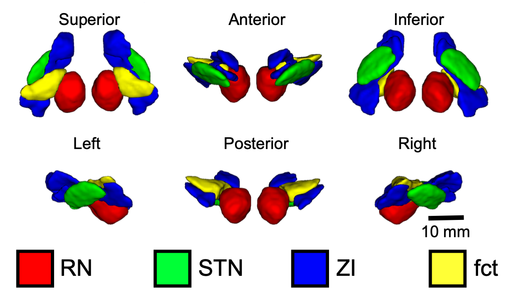

# zona-analysis

**Direct visualization and characterization of the human zona incerta and surrounding structures**

Preprint available at: https://www.biorxiv.org/content/10.1101/2020.03.25.008318v1

## Data

Imaging Data available on OSF.io at: https://osf.io/c8p5n/

## Scripts

Scripts for template creation, volumetric analysis, and point analysis in `scripts/`

## Notebooks

Jupyter Notebooks for the associated manuscript in `notebooks`:

  * `01_template_creation.ipynb` -- Template Creation Validation using AFIDs http://dx.doi.org/10.1002/hbm.24693 
  * `02_voxel_overlap_segmentations.ipynb` -- Voxel Overlap for Segmentations
  * `03_regions_of_interest.ipynb` -- Regions of Interest
  * `03_regions_of_interest_MSTRCHT.ipynb` -- Replication of ROI analysis in Maastricht dataset
  * `04_psa_analysis.ipynb` -- Point analysis in the posterior subthalamic area

